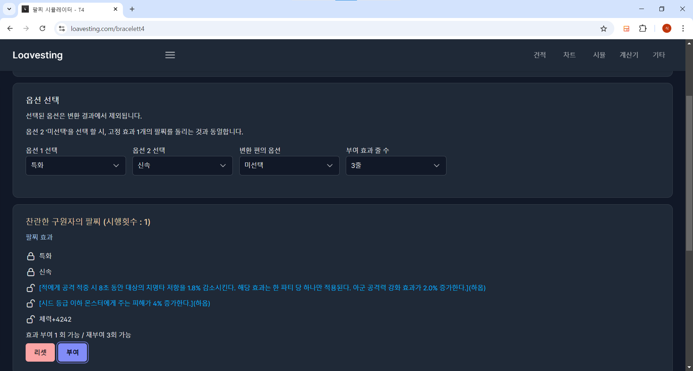

# 로아베스팅

  

  

# 서비스 소개 
lostark open api 및 공개 확률을 활용한 사이트 입니다.

  

# 핵심 기능

## 1. 차트

- 재료의 전일대비 등락폭을 확인할 수 있어요.
- 과거 데이터와 현재 데이터를 비교할 수 있어요.

   

## 2. 재련 견적서

- 목표 레벨 달성에 필요한 재료를 실시간 데이터로 확인해요.
- 개인이 가지고 있는 재료를 입력하여 예상 재화를 계산해요.
- 장인의 기운 슬라이스 조절을 통해 예상 비용을 계산해요.

   

## 3. 시뮬레이터

- 로스트아크 공식 확률에 따른 알고리즘으로 팔찌, 연마를 미리 해봐요.

   

## 4. 패키지 계산기

- 실시간 변동 가격과 골드 가치, 크리스탈 가치를 비교하여 패키지의 효율을 계산해요.

 
 

# 기술 스택

## 백엔드
- typescript
- nest.js
- aws
    - ec2
    - rds

## 프론트
- typescript
- nuxt3
- ec2

## Content
- s3
- cf

 
 

# 목표

> 상생 광고 플랫폼으로 타 사이트들과 협약을 맺어,
> 여러 게임 서비스에 사업자-사이트간 상생을 목표로 하고 있습니다.